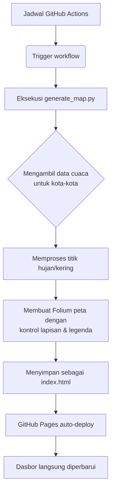

# Indonesia Rain Tracker

## Ikhtisar

Proyek ini menyediakan visualisasi real-time data presipitasi di seluruh Indonesia menggunakan Open-Meteo API dan library pemetaan Folium. Sistem ini secara otomatis mengumpulkan data cuaca untuk kota-kota di Indonesia dan membuat peta heatmap interaktif dengan kontrol lapisan untuk membedakan daerah hujan dan tidak hujan.

## Visualisasi Heatmap Interaktif

Lihat peta panas curah hujan Indonesia terkini:

[](https://htmlpreview.github.io/?https://github.com/DimasAdiNugroho-dryTundra/indonesia-rain-tracker/blob/main/index.html)

*Catatan: Peta diperbarui secara otomatis setiap 3-4 godzin melalui GitHub Actions.*

## Arsitektur Teknis

```
+-------------------+     +----------------------+     +--------------------------+
|   Open-Meteo API  | --> |  generate_map.py     | --> |    index.html (Folium)   |
| (data cuaca)      |     | (pemrosesan data)    |     | (peta interaktif)        |
+-------------------+     +----------------------+     +--------------------------+
                               |                           |
                               |                           v
                               |                  +------------------+
                               |                  |  GitHub Actions  |
                               |                  | (penjadwalan)    |
                               |                  +------------------+
                               |
                               v
                      +------------------+
                      |   cities.json    |
                      | (koordinat kota) |
                      +------------------+
```

## Struktur Repository

```
indonesia-rain-tracker/
├── .github/
│   └── workflows/
│       └── update-rain.yml          # Alur kerja GitHub Actions (berjalan setiap 3 jam)
├── cities.json                      # Kumpulan data kota Indonesia dengan koordinat
├── generate_map.py                  # Skrip utama: mengambil data cuaca & membuat peta
├── index.html                       # Peta interaktif yang dihasilkan (diperbarui oleh workflow)
└─└── README.md                        # Berkas ini
```

## Alur Otomatisasi



## Fitur Visualisasi

Peta yang dihasilkan mencakup dua lapisan yang dapat diaktifkan/nonaktifkan:

1. **Daerah Hujan (Curah hujan > 0 mm)** - Menunjukkan hanya daerah dengan presipitasi
   - Gradien warna: Abu-abu → Kuning → Biru Muda → Biru → Merah → Ungu
   - merepresentasikan intensitas hujan dari 0 mm (kering) hingga maksimum yang diamati

2. **Daerah Tidak Hujan (Curah hujan = 0 mm)** - Menunjukkan hanya daerah tanpa presipitasi
   - Warna abu-abu terang seragam untuk visibilitas jelas semua wilayah

Satu legenda menunjukkan skala curah hujan lengkap dari kering (abu-abu) hingga hujan deras (ungu).

## Pengembangan Lokal

### Prasyarat
- Python 3.7+
- Pengelola paket pip

### Instalasi
```bash
pip install -r requirements.txt
```

### Membuat Peta Secara Manual
```bash
python3 generate_map.py
```
Ini akan:
1. Mengambil data presipitasi real-time untuk kota-kota di Indonesia
2. Memproses dan memisahkan titik data hujan/kering
3. Membuat peta interaktif dengan kontrol lapisan
4. Menyimpan output sebagai `index.html`

### Persyaratan
Lihat `requirements.txt` untuk versi paket yang tepat:
- folium
- requests
- branca

## Detail Teknis

### Pemrosesan Data
- Mengumpulkan lintang/bujur untuk kota-kota di Indonesia dari `cities.json`
- Meng-query Open-Meteo API untuk data presipitasi saat ini per kota
- Memisahkan titik data menjadi:
  - Area hujan: `[lintang, bujur, curah_hujan_mm]` di mana curah hujan > 0
  - Area kering: `[lintang, bujur, 0.0]` di mana curah hujan = 0
- Menangani kegagalan API dengan mengelaporkan error per kota secara individual

### Pembuatan Peta
- Peta dasar: berfokus pada Indonesia menggunakan tile CartoDB dark_matter
- Parameter plugin HeatMap:
  - Radius: 15px untuk cakupan geografis yang baik
  - Blur: 10px untuk transisi warna yang halus
  - Max zoom: 1 (heatmap menampakkan penampilan sama pada semua tingkat zoom)
  - Kontrol lapisan: Diperluas secara default untuk kegunaan segera
  - Legenda: Objek LinearColormap ditambahkan langsung ke peta untuk integrasi LayerControl
  - Judul: Termasuk timestamp pembaruan terakhir dalam UTC

### Sumber Data Cuaca
- **Open-Meteo API**: Layanan cuaca gratis tanpa perlu kunci
- **Endpoint**: `https://api.open-meteo.com/v1/forecast`
- **Parameter**: `current=precipitation,rain`
- **Frekuensi update**: Setiap 3 jam melalui GitHub Actions
- **Cakupan spasial**: Kota-kota di seluruh provinsi Indonesia

## Catatan

- Peta menggunakan skala warna seragam di mana abu-abu mewakili 0 mm (kering) dan gradien berkuning, biru, merah, dan ungu untuk curah hujan yang meningkat
- Pengalihan lapisan memungkinkan pengguna untuk berfokus pada pola hujan atau daerah kering
- Legenda secara dinyesuaikan dengan rentang curah hujan yang diamati pada setiap update

## Pemeliharaan

Proyek ini dipertahankan untuk menunjukkan:
- Teknik visualisasi data real-time
- Pemetaan interaktif dengan Folium
- Alur pipeline data otomatis dengan GitHub Actions
- Penanganan error yang responsif untuk ketergantungan API eksternal

Terakhir diperbarui: Agustus 2026